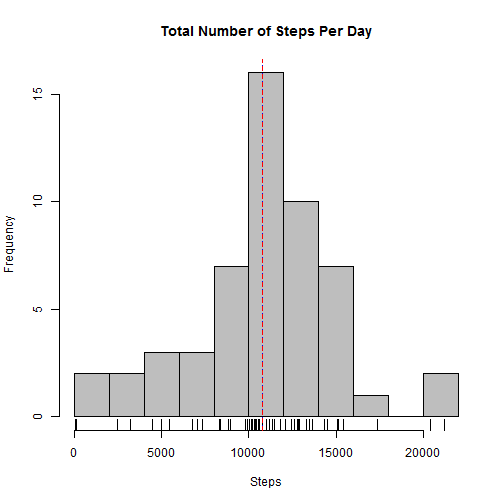
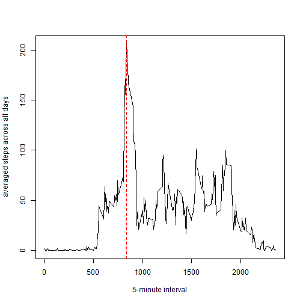
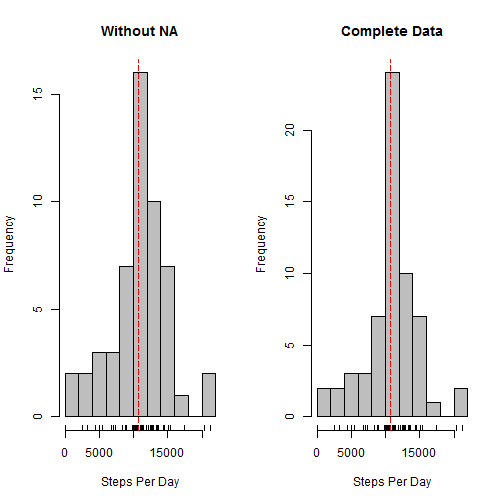
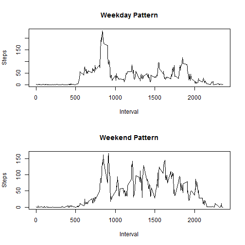

---------------------------------------
             Project 1 Assignment
---------------------------------------

###Loading necessary package for data 


```r
library(lattice)
library(dplyr)
```

###Loading and preprocessing the data

* step 1: Reading Data
* step 2: Removing cases where steps are NA/missing


```r
active<-read.csv("activity.csv",stringsAsFactors = F)
active1<-filter(active,is.na(steps) == FALSE)
```

###What is mean total number of steps taken per day?

* step 1: Grouping data by date
* step 2: summarising data for total number of steps taken per day
* step 3: Plotting histogram for total number of steps taken each day
* step 4: Calculating Mean and Median
* step 5: Reporting Mean and Median calculated in step 4


```r
acitve2<-group_by(active1,date)
acitve3<-summarise(acitve2,count = n(),Steps_per_day = sum(steps))

hist(acitve3$Steps_per_day,breaks = 15,col = "grey", main = "Total Number of Steps Per Day",xlab = "Steps")
rug(acitve3$Steps_per_day)

MN_STEPS<-mean(acitve3$Steps_per_day)
MD_STEPS<-median(acitve3$Steps_per_day)

meanstr <- sprintf("mean = %.2f", MN_STEPS)
medianstr <- sprintf("median = %.2f", MD_STEPS)

abline(v = MD_STEPS, lty = 3, col = "blue")
abline(v = MN_STEPS, lty = 2, col = "red")
```



Mean and Median of total number of steps per day is 1.0766189 &times; 10<sup>4</sup> and 10765 respectively.

  

###What is the average daily activity pattern?


* step 1: Grouping data by interval
* step 2: summarising data for average number of steps taken across all days for each interval
* step 3: Plotting Timeseries for With 5-minute interval On x-axis and the average number of steps taken on y-axis
* step 4: Calculating interval with maximum number of steps taken
* step 5: Reporting value calculated in step 4


```r
acitve4<-group_by(active1,interval)
acitve5<-summarise(acitve4,count = n(),Steps_5min_inter = mean(steps))
plot(acitve5$interval,acitve5$Steps_5min_inter,type = "l",xlab = "5-minute interval",ylab = "averaged steps across all days")
max_interval<-acitve5$interval[acitve5$Steps_5min_inter == max(acitve5$Steps_5min_inter)]

abline(v = max_interval, lty = 2, col = "red")
text(1000,"cutoff",col = "red")
```



on average across all the days in the dataset, 835 interval contains the maximum number of steps


###Imputing missing values


* step 1: activeNA data sliced with NA values for all cases
* step 2: Merge data used to replace NA in step variable with average number of steps taken in each interval from acitve5 created above, interval is used as primary key for merging
* step 3: Create another data set by keeping same variables as orginal data set, this data set is now having all the values for steps which were missin earlier
* step 4: Now combining finalmerged1 and active1 to make final clean data set with sample size equal to original, please check cleandata
* step 5: summarised the final clean data by calculating total number of steps per day
* step 6: histogram is plotted side by side for data set Without NA and Complete Clean data in same pan
* step 7: Conclusive differnce is reported


```r
activeNA<-filter(active,is.na(steps) == TRUE)

finalmerged<-merge(activeNA, acitve5, by.x = "interval", by.y = "interval")
finalmerged$steps[is.na(finalmerged$steps)]<-finalmerged$Steps_5min_inter
finalmerged1<-select(finalmerged,steps,date,interval)
cleandata<-rbind(finalmerged1,active1)


totalperday<-group_by(cleandata,date)
totalperday1<-summarise(totalperday,stepsperday = sum(steps),count = n())

par(mfrow = c(1,2))

hist(acitve3$Steps_per_day,breaks = 15,col = "grey", xlab = "Steps Per Day",main = "Without NA")
rug(acitve3$Steps_per_day)

abline(v = MD_STEPS, lty = 3, col = "blue")
abline(v = MN_STEPS, lty = 2, col = "red")


hist(totalperday1$stepsperday,breaks = 15,col = "grey", xlab = "Steps Per Day",main = "Complete Data")
rug(totalperday1$stepsperday)

TOT_MN_STEPS<-mean(as.numeric(totalperday1$stepsperday))
TOT_MD_STEPS<-median(as.numeric(totalperday1$stepsperday))

abline(v = TOT_MD_STEPS, lty = 3, col = "blue")
abline(v = TOT_MN_STEPS, lty = 2, col = "red")
```



Mean and Median of total number of steps per day is 
1.0766189 &times; 10<sup>4</sup> and 1.0766189 &times; 10<sup>4</sup> respectively in clean data set 
with NA removed with average values, this is 
same as we had in the dataset where we NAs were removed.

Only difference is the increase in frequency/number of cases.

###Are there differences in activity patterns between weekdays and weekends?


```r
cleandata$weekday<-weekdays(as.Date(cleandata$date))

cleandata$Work[cleandata$weekday == "Monday"]<-1
cleandata$Work[cleandata$weekday == "Tuesday"]<-1
cleandata$Work[cleandata$weekday == "Wednesday"]<-1
cleandata$Work[cleandata$weekday == "Thursday"]<-1
cleandata$Work[cleandata$weekday == "Friday"]<-1
cleandata$Work[cleandata$weekday == "Saturday"]<-2
cleandata$Work[cleandata$weekday == "Sunday"]<-2

myweekends<-subset(cleandata,Work==2)
myweekdays<-subset(cleandata,Work==1)

myweekdays1<-group_by(myweekdays,interval)
myweekdays2<-summarise(myweekdays1,stepsperinterval = mean(steps),count = n())

myweekends1<-group_by(myweekends,interval)
myweekends2<-summarise(myweekends1,stepsperinterval = mean(steps),count = n())

myweekdays2$flag<-1
myweekends2$flag<-2


dummy<-rbind(myweekdays2,myweekends2)

par(mfrow = c(2,1))

plot(myweekdays2$interval,myweekdays2$stepsperinterval,xlab = "Interval",ylab = "Steps",main = "Weekday Pattern",type = "l")

plot(myweekends2$interval,myweekends2$stepsperinterval,xlab = "Interval",ylab = "Steps",main = "Weekend Pattern",type = "l")
```



There's a difference between weekday and weekend activity pattern as depicted by two overlayed line graph, blue line reperesent weekday pattern
and red line represent weekend pattern. Average number of steps taken weekend i.e. 42.3664013 is more than weekdays i.e. 35.6105812

